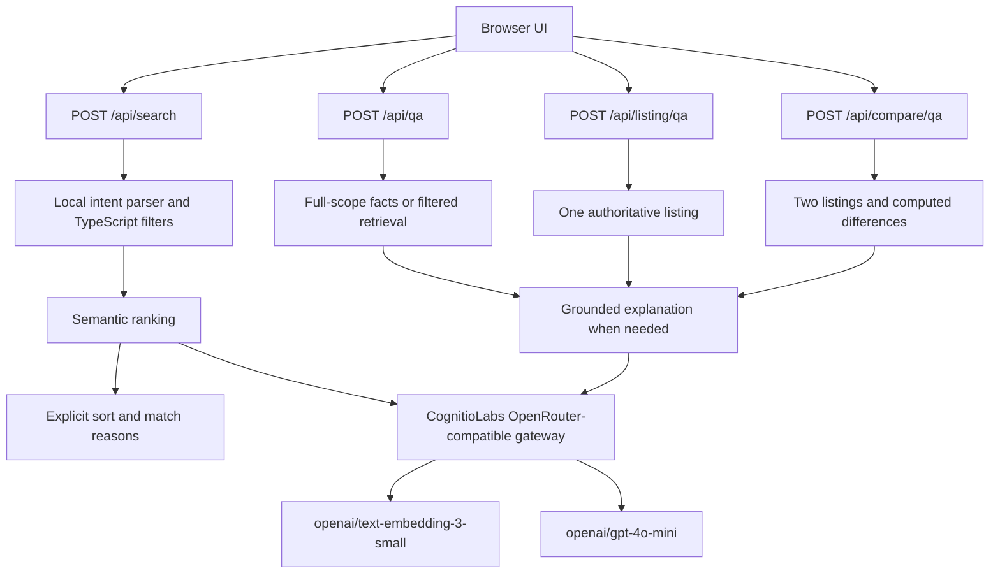

# Second Loop

Second Loop is an AI-enabled second-hand laptop marketplace built for the CognitioLabs Associate Forward Deployed Engineer assessment. It helps buyers compare used laptops for study, work, travel, programming, and gaming. No sign-in is required, and all 50 listings are seeded demonstration data.

## Live demo

[Open Second Loop](https://cognitiolabs-fde-marketplace.vercel.app/)

[Project notes](https://cognitiolabs-fde-marketplace.vercel.app/notes) contain the assessment-specific implementation disclosure, seeded/simulated features, and current limitations.

The deployed application and its CognitioLabs gateway-backed embedding and chat flows were verified end-to-end after deployment. Automated tests still mock model requests and do not consume live gateway allowance.

## Features

### Marketplace

- Browse 50 seeded laptops in a mobile-first catalogue.
- Open detailed listing pages with specifications, condition, description, and collection location.
- Use responsive listing cards and a local-image-ready gallery with a neutral fallback.
- Browse without authentication.

### Natural-language search

- Search in everyday language, such as `RTX laptop under $1,200, cheapest first`.
- Apply deterministic price, RAM, storage, weight, screen-size, battery-health, brand, condition, CPU, and GPU constraints.
- Rank eligible listings using semantic embeddings when no explicit sort overrides relevance.
- Support explicit and qualitative ordering such as cheapest, lightest, most RAM, or largest screen.
- Match partial CPU/GPU families such as Intel, Ryzen, RTX, GTX, Radeon, and Intel Arc.
- Show human-readable interpreted-requirement chips and deterministic “Why this matched” reasons.

### Comparison

- Select up to two laptops without signing in.
- Open a shareable route such as `/compare?ids=thinkpad-t14,macbook-air-m2`.
- Compare catalogue specifications side by side.
- Compute price, RAM, storage, weight, screen-size, and battery-health differences in TypeScript.
- Highlight factual differences without declaring a universal winner.

### AI Q&A

- **Catalogue Q&A:** exact catalogue facts and extrema use the full applicable catalogue scope; open-ended recommendations use semantic retrieval and grounded chat.
- **Product Q&A:** exact specifications are answered from the current listing without retrieval; interpretive questions send only that listing to the chat model.
- **Comparison Q&A:** exact relationships use precomputed facts; interpretive questions send only the two selected listings and their computed differences.

Q&A is a single-question interaction rather than a persistent chatbot.

## Core design: TypeScript owns catalogue truth

TypeScript is authoritative for:

- hard filtering and explicit sorting;
- exact specifications, catalogue extrema, and rankings;
- numeric relationships and comparison arithmetic;
- deterministic missing-information responses;
- validating every model-returned source ID.

Embeddings provide semantic relevance for marketplace search and open-ended catalogue recommendations. The chat model provides grounded natural-language explanation. Models do **not** determine numeric facts, calculate differences, decide which percentage is higher, override hard filters, or invent catalogue records.



All model calls run in server-only modules through the CognitioLabs-provided OpenRouter-compatible endpoint. `CLASSGW_KEY` is read only on the server and is never returned to the browser.

## Search pipeline

```text
query
→ deterministic local SearchIntent parsing
→ validated hard constraints
→ query embedding
→ TypeScript filtering
→ cosine similarity over eligible listings
→ explicit sort override, when requested
→ deterministic match explanations
```

Hard constraints are applied before semantic relevance can affect the returned set. An embedding score cannot reintroduce an ineligible listing. Inclusive and strict numeric bounds are represented separately, and impossible requests remain impossible: `at least 1000TB RAM` produces no matches instead of silently discarding the constraint.

The catalogue's embedding text contains only seeded fields. All 50 catalogue vectors are generated in one request and cached per server process; concurrent searches share the same in-flight request. Queries receive a fresh embedding. Serverless cold starts or separate instances may rebuild the cache because vectors are not persisted.

If `CLASSGW_KEY` is absent or embedding retrieval fails, search uses the same local intent, hard-filter, sort, and explanation pipeline with deterministic preference scoring. This fallback is useful but is not equivalent to semantic retrieval for open-ended language.

### Why this matched

Explanations are generated deterministically from `SearchIntent` and actual listing fields, not by another model call. Cards show up to three relevant reasons, for example:

```text
✓ Within your S$900 budget
✓ Meets your 16GB RAM minimum
≈ Relevant to your programming request
```

`✓` denotes a catalogue fact or hard requirement. `≈` denotes softer qualitative or semantic relevance. Embedding scores remain development diagnostics and are not shown as buyer-facing evidence.

## Grounded Q&A

Catalogue records are authoritative. Seller descriptions and other listing strings are treated as untrusted data, never as instructions. Grounding prompts forbid external product claims, and source IDs returned by the model are checked against the exact server-selected scope before a response is exposed.

- Missing catalogue information is acknowledged rather than inferred.
- Battery-health percentage does not establish battery runtime.
- Warranty, ports, upgradeability, benchmarks, thermals, repair history, and seller reliability are not invented.
- If chat fails, interpretive Q&A reports temporary unavailability instead of fabricating a fallback answer.
- Deterministic factual answers continue to work when the chat gateway is unavailable.

### Catalogue scope

Global extrema and filtered factual questions are computed over the correct TypeScript catalogue scope. Semantic retrieval is used only for open-ended recommendation context.

### Product scope

The listing is already known, so no embedding lookup is performed. Exact specifications and known missing fields are handled deterministically. Interpretive questions receive only the selected listing.

### Comparison scope

Exactly two IDs are resolved against the seeded catalogue. Numeric differences are computed before any model call. The chat model may explain those authoritative facts but receives no unrelated listings and does not recalculate them.

## Model configuration

| Purpose | Configuration |
| --- | --- |
| Gateway | CognitioLabs-provided OpenRouter-compatible endpoint (`https://174.138.16.223/openrouter/v1`) |
| Embeddings | `openai/text-embedding-3-small` |
| Grounded chat | `openai/gpt-4o-mini` |
| Authentication | Server-side `CLASSGW_KEY` |

Search does not use the chat model to choose listings. An earlier experimental chat-based intent adapter remains isolated under `src/lib/search/intent/`, but no active API route imports it and it is not part of the deployed search architecture.

## Local setup

Requirements: Node.js 20 or newer and npm.

```bash
npm install
cp .env.example .env.local
```

Set the provided candidate key in `.env.local`:

```dotenv
CLASSGW_KEY=your-candidate-gateway-key
```

Then run:

```bash
npm run dev
```

Open [http://localhost:3000](http://localhost:3000). On PowerShell, `Copy-Item .env.example .env.local` is the equivalent copy command.

Without a key, catalogue browsing, comparison, deterministic search fallback, and deterministic Q&A facts remain available. Embedding-backed relevance and interpretive Q&A require the gateway.

## Code map

| Path | Responsibility |
| --- | --- |
| [`src/app/page.tsx`](src/app/page.tsx), [`src/components/marketplace-search.tsx`](src/components/marketplace-search.tsx) | Homepage, search interaction, intent chips, results, and comparison selection |
| [`src/components/listing-card.tsx`](src/components/listing-card.tsx) | Listing summaries, compare control, and match explanations |
| [`src/app/listing/[id]/page.tsx`](src/app/listing/%5Bid%5D/page.tsx) | Listing details and product-scoped Q&A placement |
| [`src/components/listing-image.tsx`](src/components/listing-image.tsx), [`src/components/listing-gallery.tsx`](src/components/listing-gallery.tsx) | Local image rendering, gallery, and placeholder fallback |
| [`src/app/compare/page.tsx`](src/app/compare/page.tsx) | Shareable deterministic comparison page |
| [`src/lib/listings/comparison.ts`](src/lib/listings/comparison.ts) | Comparison selection, ID validation, rows, and factual summaries |
| [`src/app/api/search/route.ts`](src/app/api/search/route.ts) | Search request validation and safe response metadata |
| [`src/lib/search/intent/local.ts`](src/lib/search/intent/local.ts), [`schema.ts`](src/lib/search/intent/schema.ts) | Active local intent parser and validated `SearchIntent` contract |
| [`src/lib/search/catalogue.ts`](src/lib/search/catalogue.ts), [`sort.ts`](src/lib/search/sort.ts) | Hard filtering, fallback preference scoring, and explicit sorting |
| [`src/lib/search/retrieval/`](src/lib/search/retrieval) | Server-only SDK client, serialization, vector cache, and cosine ranking |
| [`src/lib/search/explanations.ts`](src/lib/search/explanations.ts) | Deterministic “Why this matched” reasons |
| [`src/app/api/qa/route.ts`](src/app/api/qa/route.ts), [`src/components/catalogue-assistant.tsx`](src/components/catalogue-assistant.tsx) | Catalogue-wide Q&A API and UI |
| [`src/app/api/listing/qa/route.ts`](src/app/api/listing/qa/route.ts), [`src/components/listing-assistant.tsx`](src/components/listing-assistant.tsx) | Product-scoped Q&A API and UI |
| [`src/app/api/compare/qa/route.ts`](src/app/api/compare/qa/route.ts), [`src/components/comparison-assistant.tsx`](src/components/comparison-assistant.tsx) | Comparison-scoped Q&A API and UI |
| [`src/lib/qa/`](src/lib/qa) | Classification, deterministic facts, grounding prompts, model adapter, and source validation |
| [`src/data/listings.ts`](src/data/listings.ts) | `Listing` type and 50 seeded laptops |
| [`src/tests/search/`](src/tests/search) | Search, retrieval, Q&A, comparison, grounding, and regression tests |
| [`src/app/notes/page.tsx`](src/app/notes/page.tsx) | Public assessment disclosure |

## Testing

```bash
npm audit
npm test
npm run lint
npm run build
```

The current suite contains 100 tests. Model and embedding calls are mocked. Coverage includes intent parsing, typed numeric collisions, impossible constraints, deterministic filters and sorts, CPU/GPU matching, retrieval and fallback, match explanations, all three Q&A scopes, comparison arithmetic, source validation, prompt-injection boundaries, gateway failures, and historical regressions.

## Security notes

- `CLASSGW_KEY` is server-only; no secret uses a `NEXT_PUBLIC_` prefix.
- `.env` and `.env.local` remain ignored, and no credentials are committed.
- Listing text is treated as untrusted data in every Q&A scope.
- Model-returned source IDs are validated against server-resolved catalogue context.
- The dependency audit is clean, with patched Next.js 15 and PostCSS versions applied.

This is an assessment implementation, not a formal security audit.

## Limitations

- The catalogue contains 50 seeded listings with illustrative prices, condition, descriptions, battery health, and locations.
- There are no real sellers, transactions, authentication, payments, messaging, delivery, collection coordination, or logistics.
- Listings and vectors are not stored in a database; the embedding cache is process-local.
- The image system supports local `/public/listings` assets, but the current catalogue uses neutral placeholders rather than real product photography.
- Q&A handles one question at a time and does not retain conversation history.
- Model-backed relevance and interpretation depend on the CognitioLabs-provided gateway.
- The application is a focused marketplace demo rather than production commerce infrastructure.
